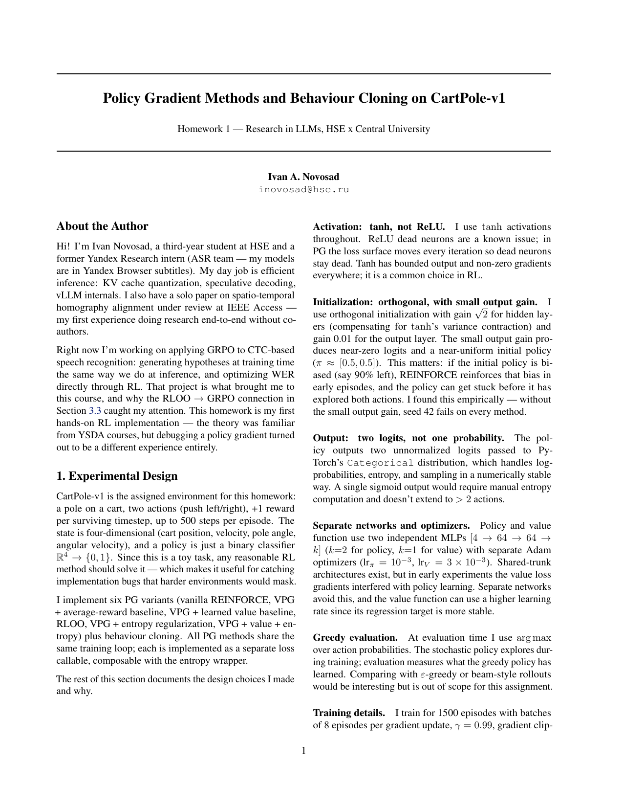
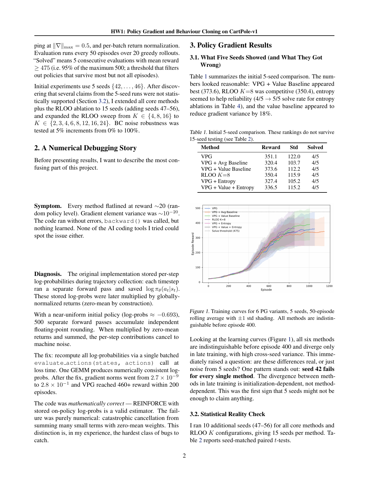
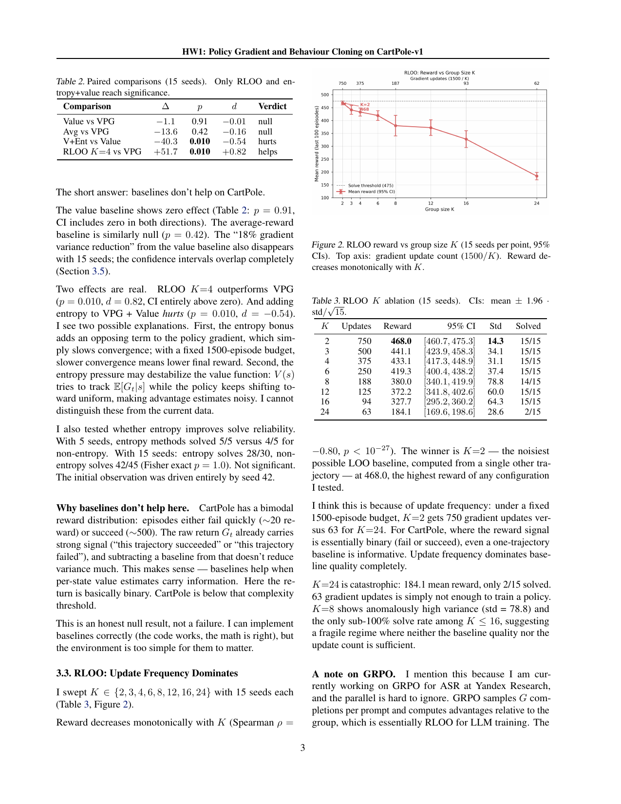
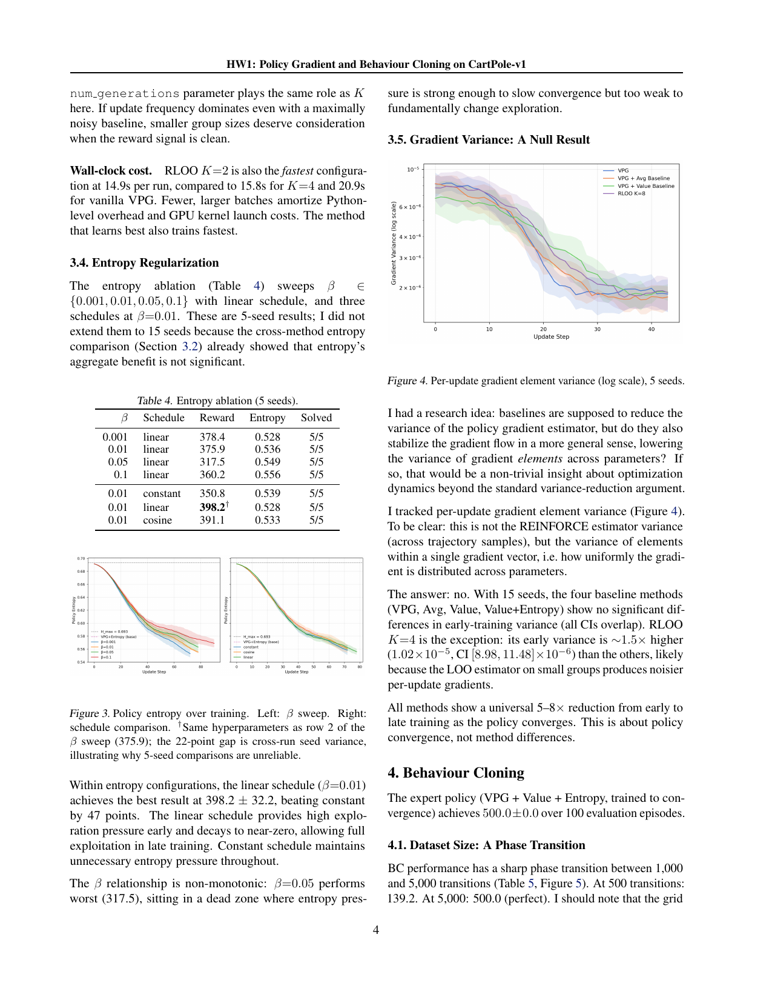
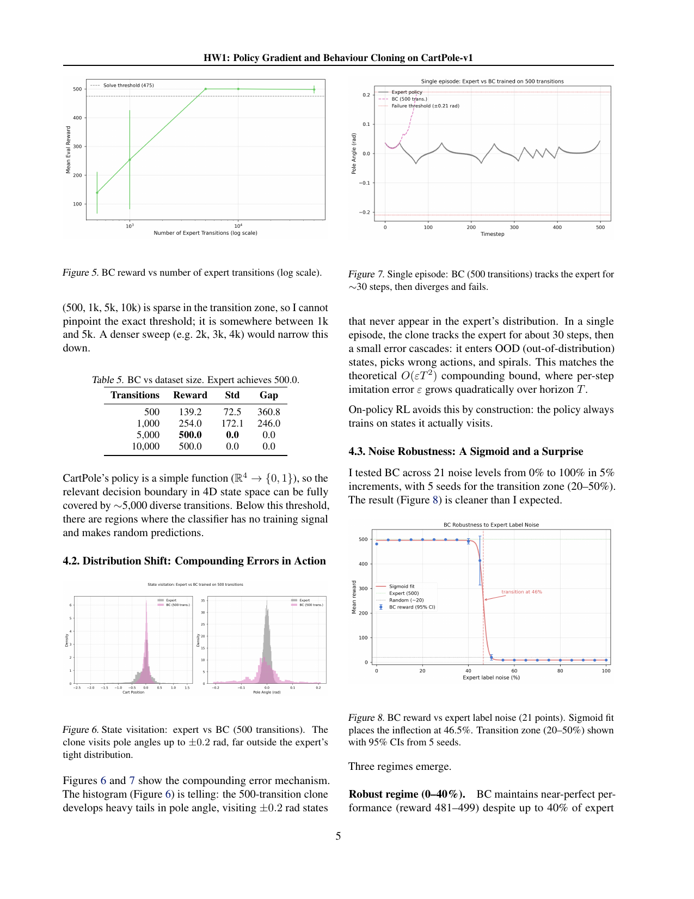
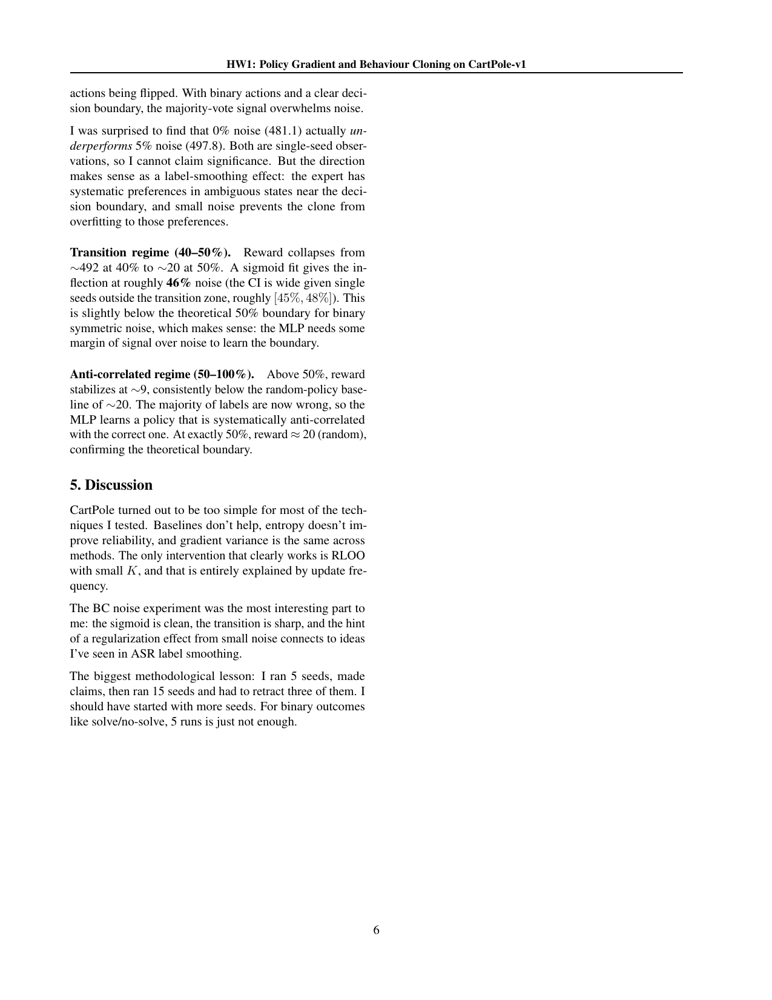

# Policy gradient methods and behaviour cloning on CartPole-v1

Variance-reduction tricks for policy gradients (baselines, entropy bonuses, leave-one-out estimators) are usually justified theoretically and then checked on a handful of seeds. I wanted to know which of them survive seed-matched statistical testing on CartPole-v1, and, on the imitation side, how behaviour cloning degrades as expert data shrinks or expert labels are corrupted.

## Method

I implement six policy gradient variants (vanilla REINFORCE, average-reward and learned value baselines, RLOO, and entropy-regularized combinations) plus behaviour cloning, all sharing one training loop. The policy is a 4→64→64→2 tanh MLP trained for 1500 episodes in batches of 8 episodes, gamma 0.99, with greedy evaluation every 50 episodes; "solved" means five consecutive evaluations at mean reward of at least 475. Initial comparisons use 5 seeds; after the rankings looked noise-driven, I extended the core methods and an RLOO sweep over K in {2, 3, 4, 6, 8, 12, 16, 24} to 15 seeds and reran every claim through paired t-tests. BC is trained on transitions from a converged expert, sweeping dataset size and the fraction of randomly flipped action labels.

## Results

- The 5-seed table suggested a learned value baseline helps (373.6 ± 112.2 vs 351.1 ± 122.0 for vanilla VPG, each solving 4/5 seeds). With 15 seeds the paired difference is −1.1 (p = 0.91): baselines do nothing on this task.
- RLOO reward decreases monotonically with group size K (Spearman rho = −0.80, 15 seeds per point). K = 2 is best at 468.0 ± 14.3 with 15/15 seeds solved, and K = 4 beats vanilla VPG by +51.7 (p = 0.010, d = 0.82). Under a fixed 1500-episode budget, update frequency matters more than baseline quality.
- BC has a sharp phase transition in dataset size (mean reward 254.0 at 1,000 expert transitions, a perfect 500.0 at 5,000) and tolerates heavy label noise: reward stays between 481 and 499 with up to 40% of expert actions flipped, then collapses; a sigmoid fit puts the inflection at 46.5% noise.

## Running

Python 3.10 or newer; everything runs on CPU. From the project root:

```bash
pip install -r requirements.txt

# Core experiments: 6 PG variants + BC, 5 seeds (~7 min on an M2 CPU)
python src/run_experiments.py --full

# Extended runs: 10 extra seeds, RLOO K sweep, BC noise sweep (~20 min)
python src/additional_experiments.py --all

# Statistical tests and figures
python src/statistical_analysis.py
python src/plotting.py
python src/plotting_extra.py
```

`run_experiments.py` also takes `--quick` (1 seed, 500 episodes) and `--bc-only`; `additional_experiments.py` can run each extension separately via `--extra-seeds`, `--rloo-curve`, `--bc-noise-full`, or `--entropy-extra-seeds`. Runtimes are approximate.

## Report

The full write-up is in [report/report.pdf](report/report.pdf): complete method details, a numerical-debugging post-mortem, all statistical tests, and the remaining figures.








Originally project 1 in a course sequence on LLM research.
