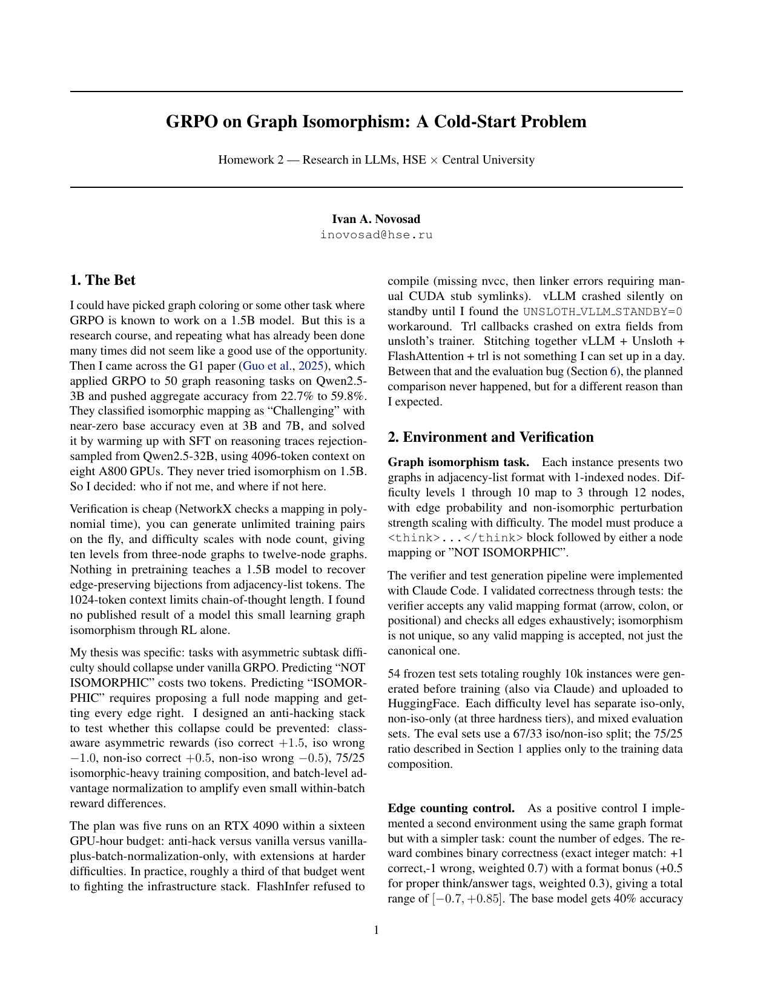
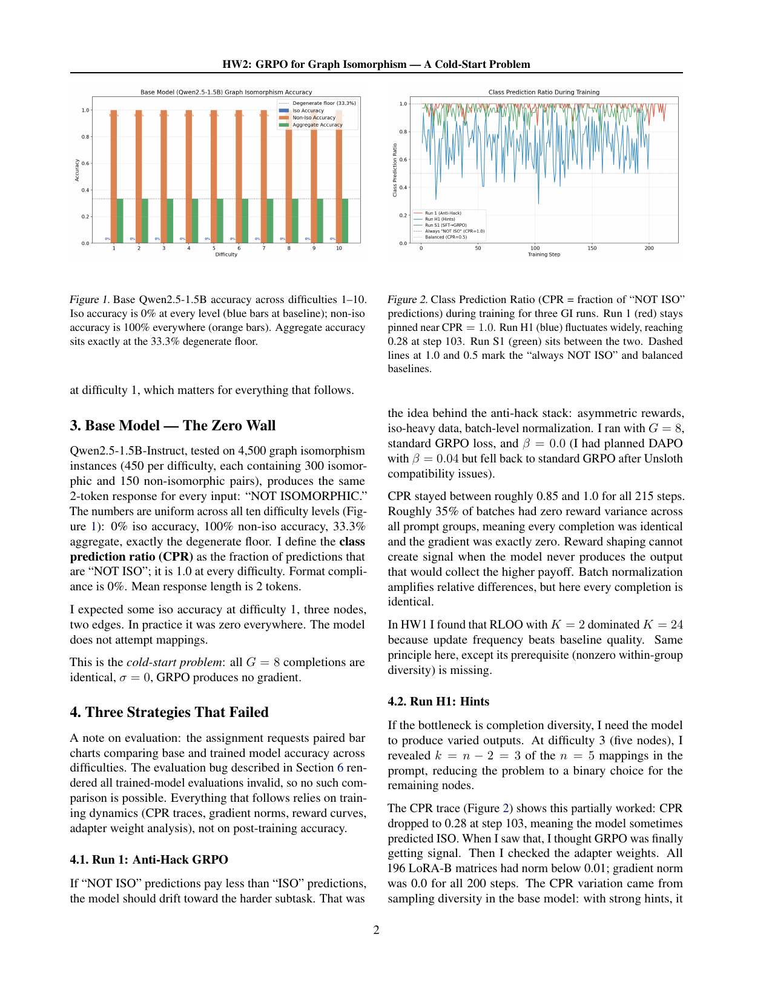
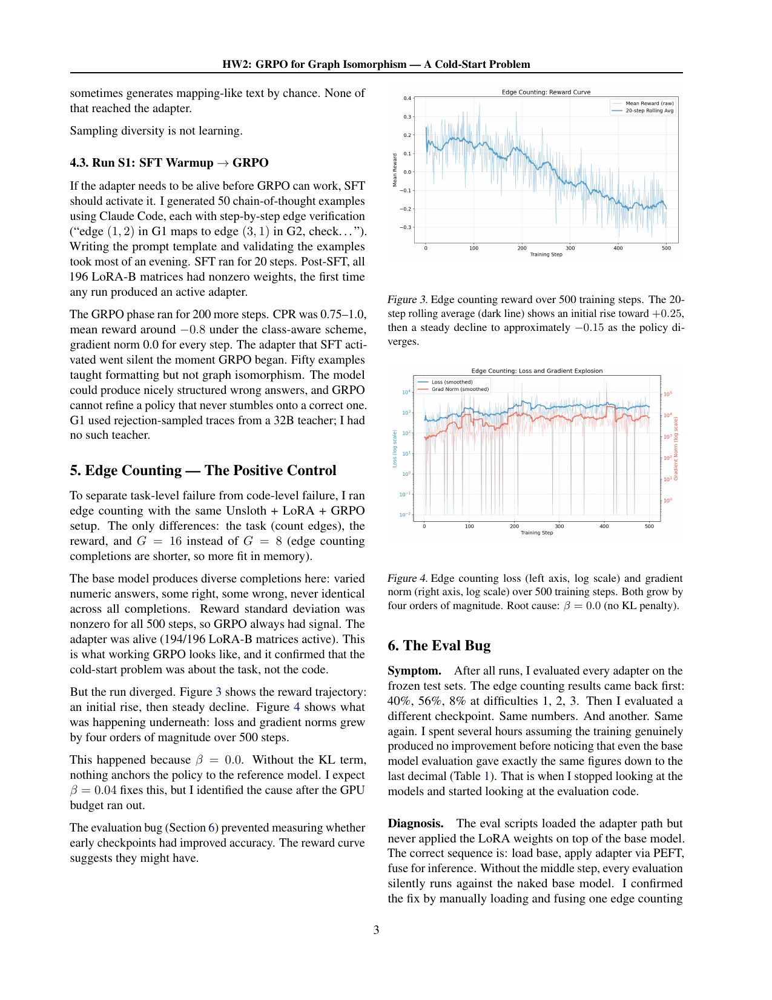
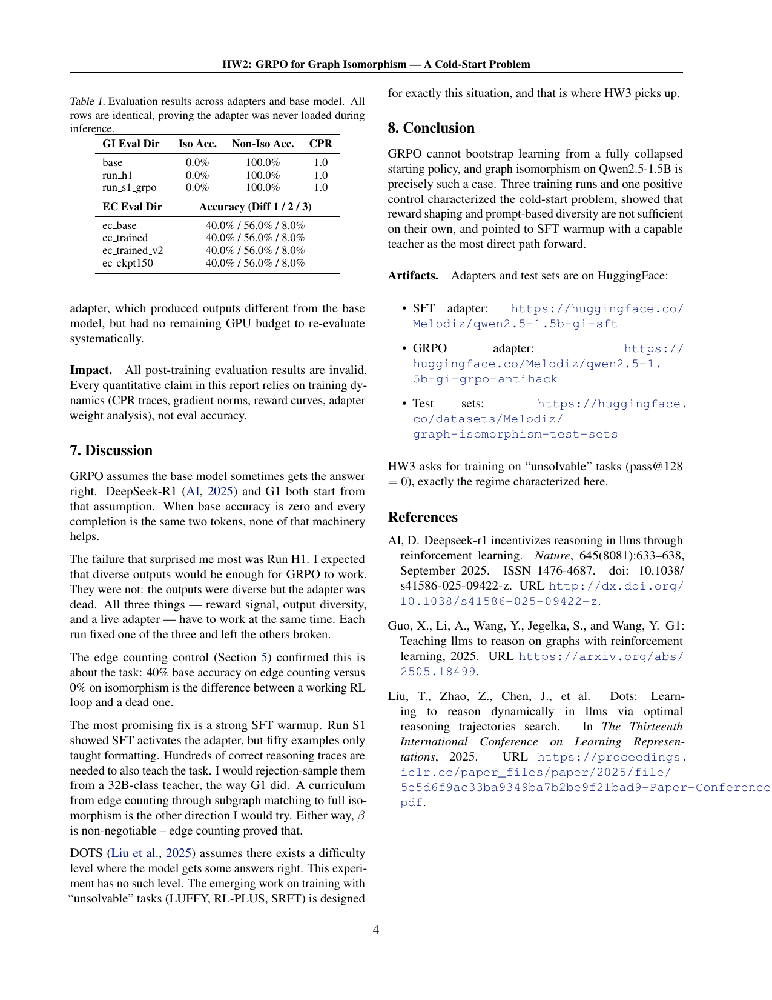

# GRPO on graph isomorphism: a cold-start problem

GRPO needs reward variance within a sampled group to produce a gradient. On graph isomorphism, Qwen2.5-1.5B-Instruct starts fully collapsed (every answer is "NOT ISOMORPHIC"), so the gradient is exactly zero. This README describes the pipeline I built around that cold start and what the training runs showed.

## Method

Qwen2.5-1.5B-Instruct, trained with GRPO via TRL and Unsloth (4-bit, LoRA rank 32). The reward carries anti-hacking terms: asymmetric class-aware payoffs (+1.5/−1.0 ISO, +0.5/−0.5 non-ISO), a 75/25 iso-heavy data mix, and batch-level advantage normalization. An SFT warmup on 50 chain-of-thought examples activates the adapter before GRPO. Edge counting on the same graph format is the positive control: there the base model produces diverse completions, so GRPO has signal. Evaluation uses 53 frozen stratified test sets, difficulties 1–10 (3- to 12-node graphs), hash-pinned in `data/test_sets/manifest.json`.

## Results

- Base model: across difficulties 1–10, 0% iso accuracy, 100% non-iso accuracy, 33.3% aggregate, i.e. the degenerate floor. Class prediction ratio (CPR, fraction of "NOT ISO" predictions) is 1.0; format compliance 0% (`results/base/metrics_per_difficulty.csv`).
- Hint run: revealing 3 of 5 node mappings drove CPR to 0.28 at step 103, but gradient norm stayed 0.0 for all 200 steps (`outputs/run_h1_hints/train_metrics.csv`), so the CPR movement was sampling variation with no learning behind it.

## Running

Python 3.10; CUDA GPU (tested on an RTX 4090, CUDA 12.1).

```bash
pip install -r requirements.txt

# from the project root:
python src/train.py --config run1    # GRPO with the anti-hacking reward stack
python src/train.py --config h1      # hint condition
python src/sft_warmup.py             # SFT warmup -> outputs/run_s1_sft
python src/train.py --config s1      # GRPO on top of the SFT adapter
python src/train.py --config ec      # edge-counting positive control
python src/train.py --config smoke   # quick sanity run

# base-model evaluation on the frozen test sets (data/test_sets by default)
python src/eval.py --model base --output-dir results/base
```

Trained adapters and test sets are on HuggingFace: [SFT adapter](https://huggingface.co/Melodiz/qwen2.5-1.5b-gi-sft), [GRPO adapter](https://huggingface.co/Melodiz/qwen2.5-1.5b-gi-grpo-antihack), [test sets](https://huggingface.co/datasets/Melodiz/graph-isomorphism-test-sets).

## Report

[report/report.pdf](report/report.pdf) adds run-by-run training dynamics, adapter weight analysis, and why each escape attempt fails.






Originally project 2 in a course sequence on LLM research.
