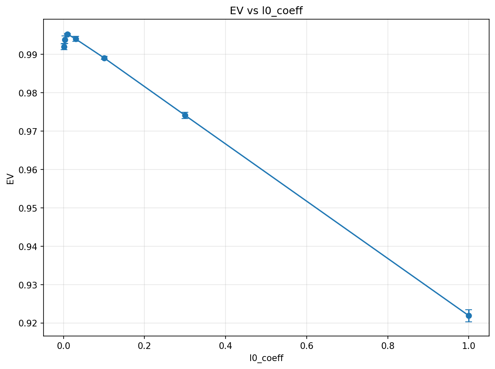

# Superposition geometry and SAE feature recovery in a toy model

In the Anthropic toy-models setting, an autoencoder compressing F sparse features into d < F dimensions stores them in superposition. SAEs should undo that compression, but real networks offer no ground truth to grade them. Here the generating features are known exactly, so recovery is directly measurable.

## Method

The toy model is `ReLU(W Wᵀ f + b)`: a linear encoder into d dimensions with a tied linear decoder, trained on sparse inputs with power-law activation probabilities (`src/toy_model.py`). A vanilla SAE (ReLU encoder, unit-norm linear decoder, MSE + L1 loss) trains on the frozen hidden states (`src/sae.py`). `src/run_experiments.py` sweeps alpha, F, d, F_sae, and l0_coeff, 3 seeds (42, 43, 44) each. Metrics (`src/metrics.py`): explained variance (EV), MMCS, weighted MMCS, feature recovery rate (cosine > 0.9), dead-latent fraction.

## Results

- EV and feature recovery decouple: d=2 gives EV = 0.997 with weighted MMCS = 1.000; d=10 gives EV = 0.977 but weighted MMCS = 0.803, with only 19% of features recovered.
- In the l0_coeff sweep, EV spans 0.922–0.995 while weighted MMCS stays within 0.926–0.942 (0.9395 at l0_coeff=0.01, seed 42); dead latents reach 0.16 at l0_coeff=1.0 (seed 42).
- Recovery rises from 0.44 at F_sae=50 to 1.00 at F_sae=400, at the cost of 23.9% dead latents.



## Running

```
pip install -r requirements.txt
python src/run_experiments.py
```

Python >= 3.10; CPU is sufficient. The script takes no arguments, regenerates all sweeps under `results/`, and hardcodes seeds 42/43/44.

## Report

[report/report.pdf](report/report.pdf) adds the d=2 polytope visualizations, training dynamics, and the unexplained d=10 difficulty.

Originally project 7 in a course sequence on LLM research.
