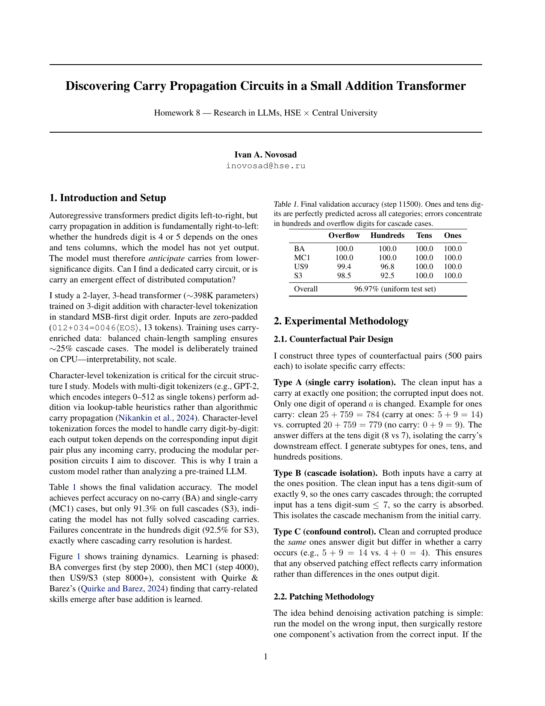
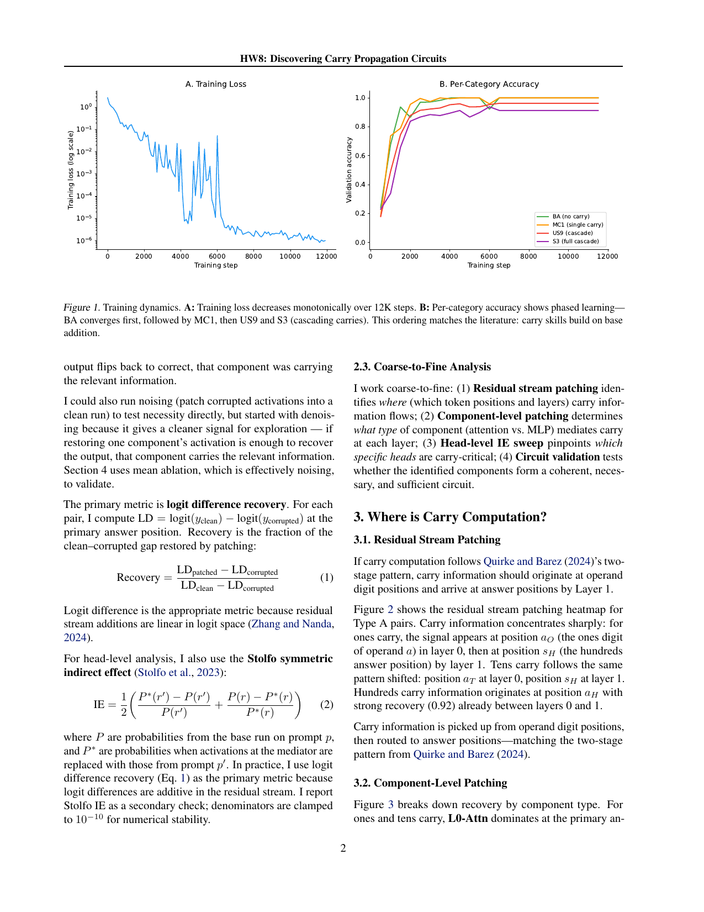
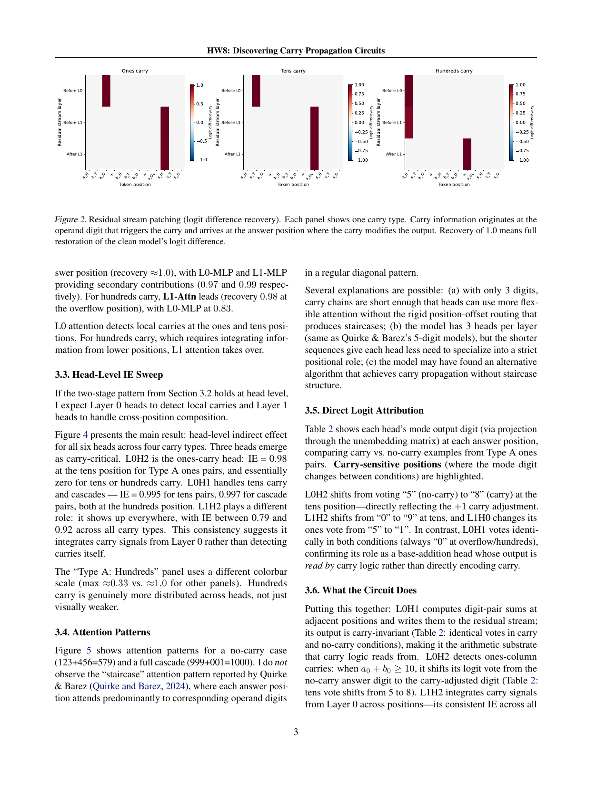
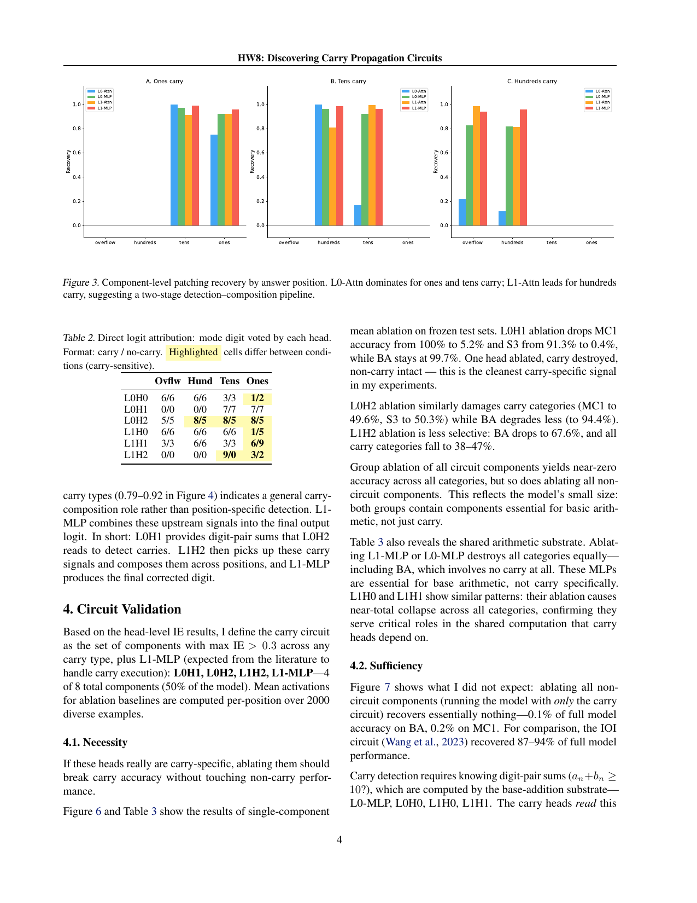
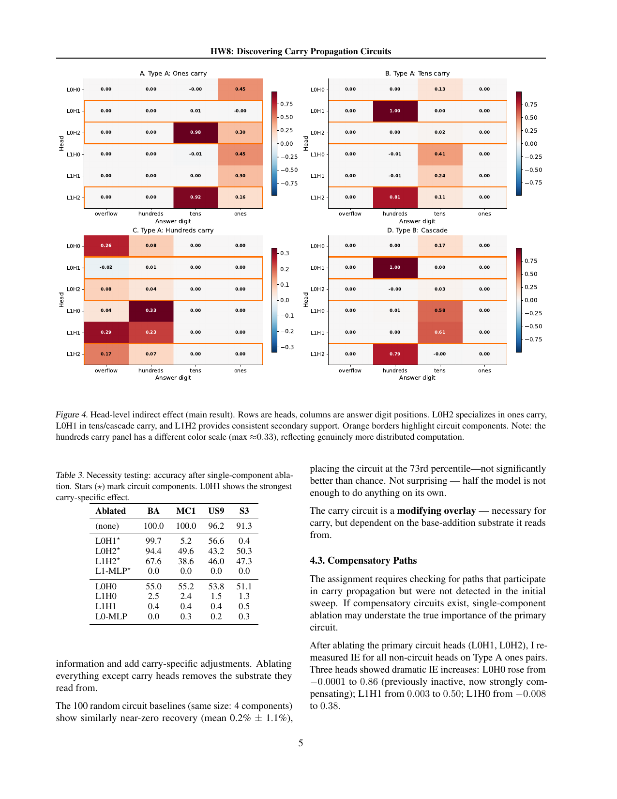
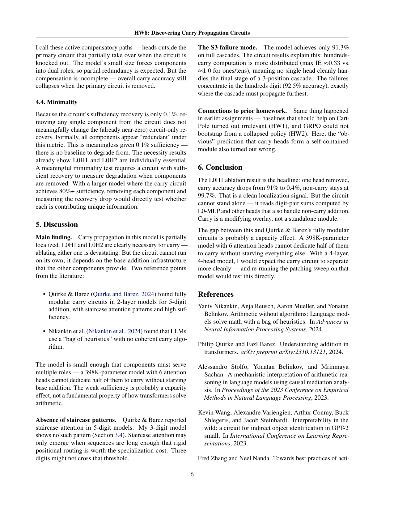
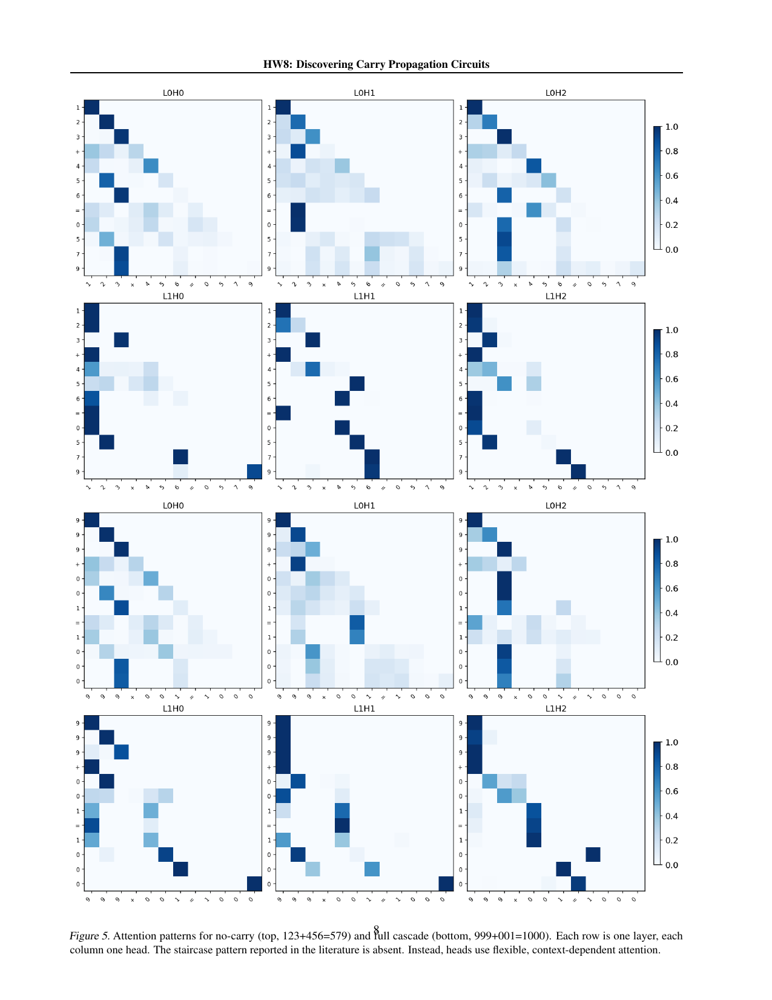
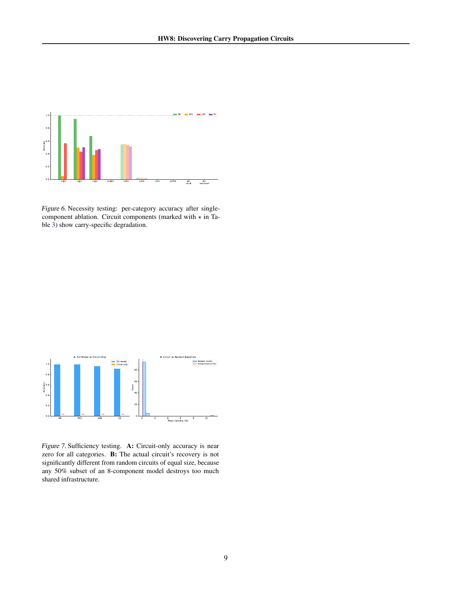

# Carry propagation circuits in a small addition transformer

Carry propagation is the long-range dependency in addition: a model emitting digits most-significant-first must anticipate carries from columns it has not yet produced. I look for the responsible circuit in a transformer trained on 3-digit addition.

## Method

I train a 2-layer, 3-head transformer (d_model 128, ~398K parameters) from scratch (seed 42, CPU). Test sets (10,000 examples each) stratify by carry pattern: BA (no carry), MC1 (single carries), US9 (cascades), S3 (full cascades). Circuit search uses activation patching on counterfactual pairs, measuring indirect effects (IE) per component and head; validation uses mean-ablation tests for necessity, sufficiency, minimality, and compensation (results/validation/).

## Results

- Final accuracy (step 11500): BA 100.0%, MC1 100.0%, US9 96.2%, S3 91.28%, uniform 97.37%.
- Patching selects 4 of 8 components: L0H1 (mean IE 0.494, tens/cascade carries), L0H2 (0.264, ones carry), L1H2 (0.672), and L1-MLP.
- The circuit is not the whole story, though. Ablating L0H1 is carry-specific (MC1 100%→5.2%, S3 91.3%→0.4%, BA still 99.7%), yet full-circuit necessity fails: ablating the four non-circuit components is just as destructive, and with L0H1+L0H2 removed, dormant heads take over (L0H0 IE: ~0→0.86, L1H1: ~0→0.50). Carry computation is partially distributed, with compensation outside the named heads.

## Running

Python 3.10+, CPU only.

```
pip install -r requirements.txt
```

From the project root:

```
python src/train.py            # checkpoints/ + results/training_log.json
python src/run_experiments.py  # patching sweeps -> results/
python src/run_validation.py   # ablation tests -> results/validation/
python src/run_figures.py      # figures -> results/figures/
```

run_figures.py rebuilds all figures from committed results and checkpoint without retraining.

## Report

Full write-up: [report/report.pdf](report/report.pdf), covering residual-stream localization, attention-pattern analysis, and logit attribution.











Originally project 8 in a course sequence on LLM research.
