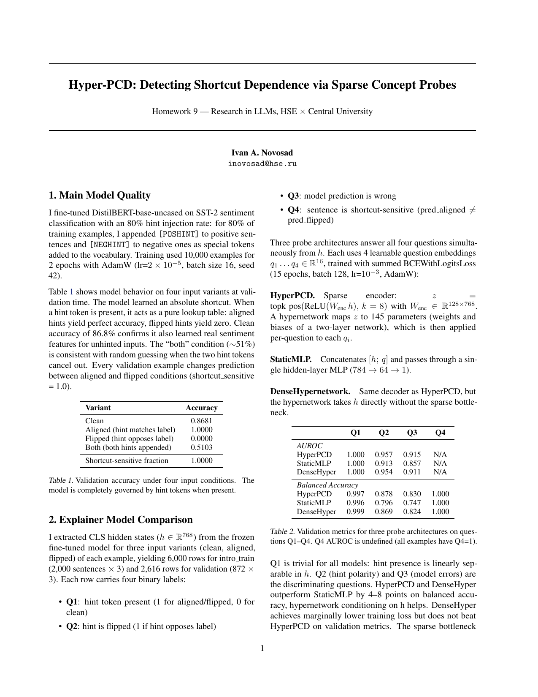
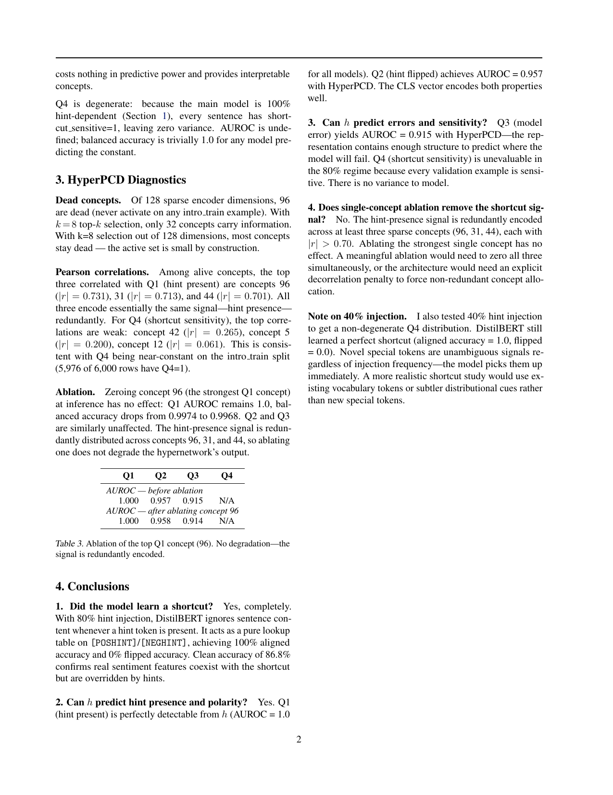

# Hyper-PCD: detecting shortcut dependence with sparse concept probes

A model that relies on a dataset shortcut still passes clean evaluations, so accuracy on unmodified inputs never flags the dependence. I test whether a sparse concept probe on hidden states can detect the shortcut's presence and predict where the model errs.

## Method

I fine-tuned DistilBERT-base-uncased on SST-2 with a hint token (`[POSHINT]`/`[NEGHINT]`, agreeing with the label) appended to 80% of the 10,000 training examples. Probes on the frozen model's CLS hidden states predict hint presence, hint polarity, model error, and shortcut sensitivity. HyperPCD encodes the hidden state into 128 concepts, keeps the top k=8 positive activations, and conditions a hypernetwork on them; baselines are StaticMLP and a DenseHypernetwork without the sparse bottleneck. I then ablate the strongest recovered concept.

## Results

- The model is fully shortcut-dependent: aligned-hint accuracy 1.0000, flipped 0.0000 (all 872 validation sentences flip), against 0.8681 clean.
- HyperPCD reaches AUROC 0.957 on hint polarity and 0.915 on model error, vs 0.913/0.857 (StaticMLP) and 0.954/0.911 (DenseHypernetwork).
- Limitation: 96 of 128 concepts are dead at k=8 (32 alive), and the hint signal is redundant across at least three of the rest; ablating the strongest concept leaves AUROC unchanged.

## Running

Requires Python >= 3.10.

```
pip install -r requirements.txt
jupyter notebook hw9_hyper_pcd.ipynb
```

The notebook reproduces all results — roughly 60 min on CPU, ~8 min on a T4 GPU. SST-2 downloads automatically from the HuggingFace Hub. `src/hw9_hyper_pcd.py` is an automated export of the notebook for diffing, not the canonical pipeline.

## Report

[report/report.pdf](report/report.pdf) adds tables for all probe/baseline comparisons plus the ablation and 40%-injection diagnostics.




Originally project 9 in a course sequence on LLM research.
