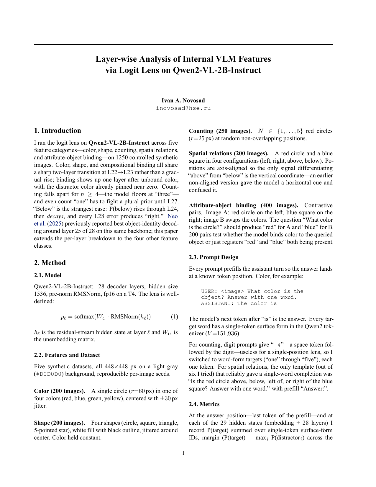
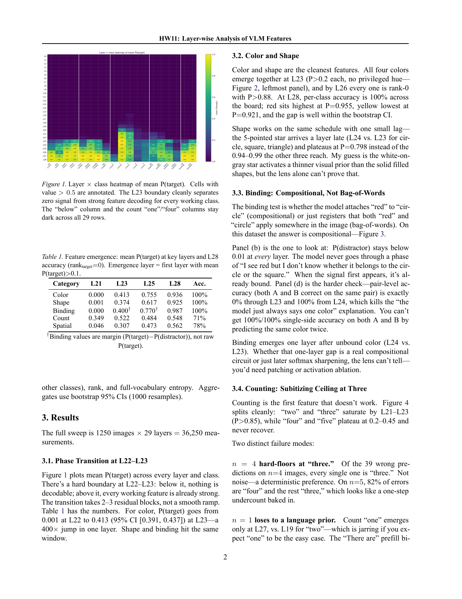
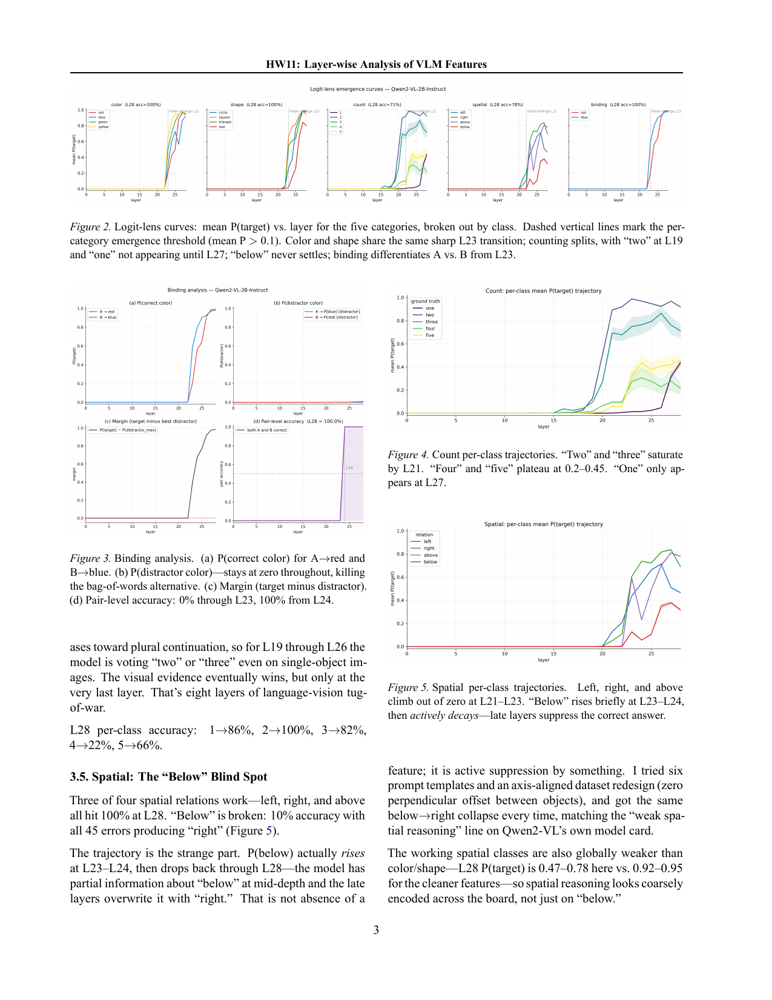
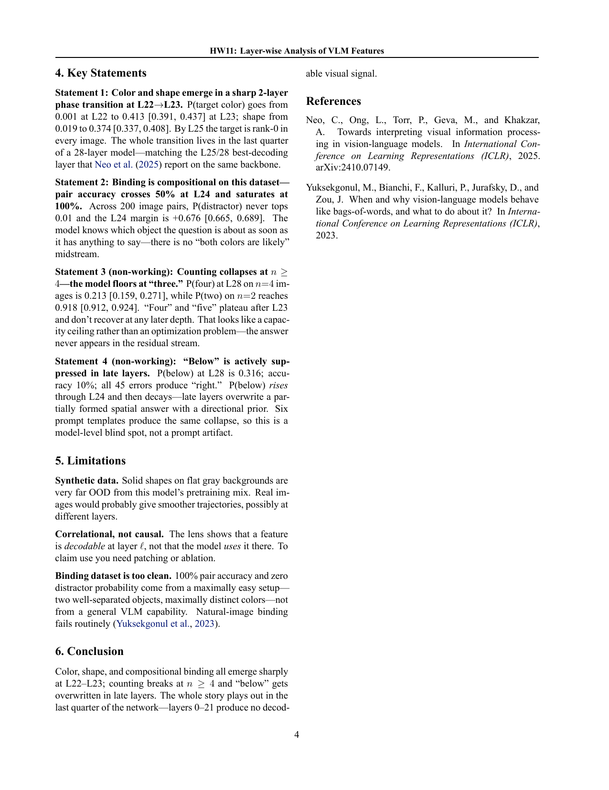

# Where visual features become readable in Qwen2-VL-2B

The logit lens (unembedding applied, after the final RMSNorm, to intermediate residual-stream states) is a cheap way to ask at which layer visual attributes become readable. I ran it at every layer of Qwen2-VL-2B-Instruct.

## Method

Five synthetic tasks — color, shape, counting red circles, spatial relations, and binding (200/200/250/200/400 images, the last from 200 contrastive color-swap pairs) — 1,250 total. Prompts prefill the assistant turn so the answer sits at a known token position; there I lens all 29 hidden states (embedding + 28 layers, fp16), recording P(target), margin, rank, and entropy: 36,250 rows in `results/logit_lens_results.csv` (9.8 MB, committed).

## Results

- Color emergence is a one-layer jump: mean P(target) 0.001 at L22 → 0.413 (95% CI [0.391, 0.437]) at L23; 100% accuracy at L28.
- Binding looks genuinely compositional: pair accuracy is 0% through L23 and 100% from L24, and P(distractor) stays below 0.01 at every layer.
- Counting collapses at n≥4: "four" and "five" plateau after L23, layer-28 accuracy is 71%, and all 39 n=4 errors say "three".

## Running

Both stages run from the project root:

```bash
pip install -r requirements.txt
python src/collect_data.py   # full sweep, ~7 min on a Colab T4
python src/analyze.py        # CPU only
```

Collection writes the CSV to the working directory (CPU or MPS work too, slowly). Analysis auto-locates the committed copy under `results/`; all seven figures and tables regenerate without a GPU.

## Report

[report/report.pdf](report/report.pdf) adds shape and spatial results — late layers actively overwrite "below" — plus bootstrap CIs and limitations.






Originally project 10 in a course sequence on LLM research.
