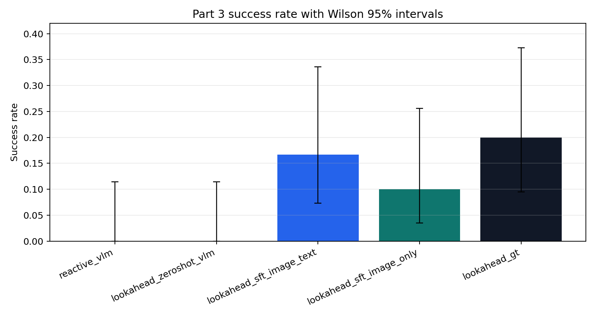

# Can a VLM learn to imagine FrozenLake?

I train a small vision-language model on one-step dynamics of deterministic 8x8 FrozenLake from rendered frames, then check whether the learned dynamics are good enough to drive a lookahead planner.

## Method

I fine-tune `Qwen/Qwen2.5-VL-3B-Instruct` with LoRA (rank 16) to predict the next player position and outcome from a frame plus an action, in two conditions: image plus ground-truth state text, and image only. Training uses 2,400 transitions from generated maps (seeds 0–79); one-step accuracy is measured on 600 validation rows from held-out maps (seeds 80–99). The predictors drive a one-step lookahead planner on 30 held-out maps (seeds 100–129) against a ground-truth-dynamics planner and zero-shot baselines.

## Results

- One-step prediction after SFT is near-perfect: 100.0% validation both-correct with image + GT state text, 99.17% image-only (`results/A7_final_assembly/part2_metrics_table.csv`).
- Planning success is low across the board: SFT image + text 16.7% (5/30), image-only 10.0% (3/30), perfect ground-truth dynamics only 20.0% (6/30) (`results/A7_final_assembly/part3_comparison_table.csv`).
- Zero-shot Qwen fails at the interface: 0.0% success and 0% format compliance; both SFT conditions reach 100% compliance.



## Running

Python 3.10 or newer (plot_results.py uses zip(strict=True)). Install with `pip install -r requirements.txt`. Training and evaluation need a GPU (the reported runs used a Colab A100); the LoRA adapters are not committed, so reproducing them means retraining:

```bash
python src/collect_data.py
python src/train_sft.py --mode train --condition image_text   # or image_only
python src/eval_world_model.py --mode eval --condition image_text
python src/run_planning.py --condition all
```

All reported tables and the success-rate plot regenerate on CPU from the committed result files:

```bash
python src/plot_results.py
```

## Report

[report/report.md](report/report.md) is the readable write-up; [report/report.pdf](report/report.pdf) is the same study in ICML 2025 format, adding full per-condition tables, confusion matrices, and planner failure analysis.

Originally project 13 in a course sequence on LLM research.
