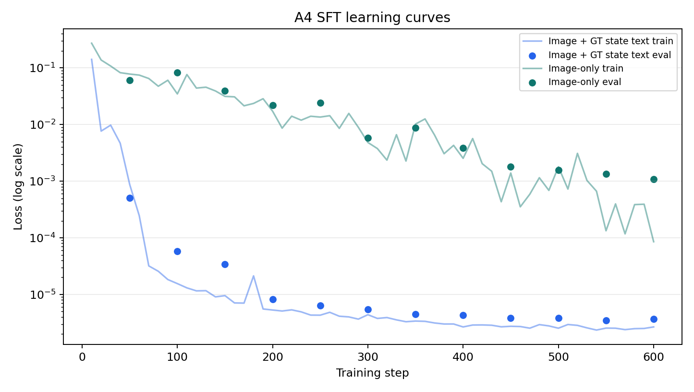

# Can a VLM Learn to Imagine FrozenLake?

**One-step prediction works. One-step greedy planning mostly does not.**

## Abstract

The short answer: yes, a VLM can learn to predict one-step FrozenLake transitions on the same generated-map distribution, with a fixed output format taught by SFT. No, that did not make planning strong by itself.

I tested this in deterministic 8x8 FrozenLake with `Qwen/Qwen2.5-VL-3B-Instruct`. The assignment had three parts: run a zero-shot VLM as a reactive agent, train VLM world models with supervised fine-tuning, then plug those world models into a one-step lookahead planner. The zero-shot reactive baseline failed under the required strict output contract: 0.0% success and 0.0% format compliance on 30 episodes. After SFT, the one-step results looked very different. The SFT image + GT state text model reached 100.0% validation both-correct accuracy; the SFT image-only model reached 99.17%.

Those accuracy numbers are real, but they are not a broad OOD world-model claim. The validation set comes from the same map generator, and rare outcomes are rare: 473 safe, 29 hole, 5 goal, and 93 wall examples.

The twist came in planning. On held-out seeds `100..129`, the best observed learned planning condition was SFT image + GT state text at 16.7% success. The perfect GT transition predictor reached only 20.0%. That changes how I read Part 3: GT dynamics shows that one-step greedy planning has a low ceiling, while learned-model planning is limited by both on-policy prediction errors and planner myopia.

## 1. The Bet

The assignment asks a clean question: can a VLM "imagine" the next transition, and can code use that transition for planning?

There are two different jobs here. A reactive VLM policy sees an image and directly chooses an action. A world-model VLM sees an image and an action, then predicts the next position and outcome. In Part 3, the VLM is not asked to plan. The code planner asks it four one-step questions, one per action, then chooses an action from the predicted outcomes.

My initial bet was simple. Zero-shot action-taking would probably be brittle. SFT should teach the output contract and the deterministic transition rule. GT state text should help if perception is the hard part, because then the model does not have to infer player, hole, and goal positions from pixels.

What surprised me was not that SFT helped. It helped a lot. The surprise was that perfect one-step dynamics did not solve the game. The GT one-step-greedy planner avoided holes but still truncated on most held-out maps.

## 2. Setup and Output Contracts

The environment is Gymnasium FrozenLake, 8x8, deterministic, with `is_slippery=False` and RGB rendering. Maps are random but checked for reachability from start to goal. Coordinates are zero-indexed `(row, col)` from the top-left. Actions follow Gymnasium's convention:

| Action | ID |
| --- | ---: |
| Left | 0 |
| Down | 1 |
| Right | 2 |
| Up | 3 |

The reactive policy had to answer with exactly one action tag:

```text
<answer>Down</answer>
```

The world model had to answer with exactly one transition tag:

```text
<prediction>Position: (r, c). Outcome: safe</prediction>
```

Valid outcomes were `safe`, `hole`, `goal`, and `wall`.

The A2 reactive system prompt was:

```text
You are controlling the player in an 8x8 FrozenLake game from a rendered image.
Choose exactly one action from: Left, Down, Right, Up.
Return only the required XML-like answer tag and no other text.
```

The reactive parser strips whitespace and then applies a fullmatch:

```python
re.fullmatch(r"<answer>(Left|Down|Right|Up)</answer>", text)
```

The world-model parser uses the same strict idea:

```python
^<prediction>Position: \((\d+), (\d+)\)\. Outcome: (safe|hole|goal|wall)</prediction>$
```

I used strict parsers. That was not decoration. In a tool-using setup, code consumes the model output. If the model returns prose or a near-miss string, the caller has to decide whether to trust it. Here I followed the assignment contract: malformed output is non-compliant. The deterministic fallback action is `Right`, action ID `2`.

This became one of the main results. Zero-shot Qwen often gave semantically close strings, but not the required tags.

Evaluation sets:

| Use | Seeds | Why |
| --- | --- | --- |
| A2 preliminary reactive baseline | `0..29` | Original Part 1 baseline run. |
| A3 train maps | `0..79` | Map-seed split for SFT training. |
| A3 validation maps | `80..99` | Held out from A3 training. |
| A6 final planning comparison | `100..129` | Held out from A3 train/val and shared by all five Part 3 conditions. |

The A6 numbers are the fair five-condition comparison for Part 3.

## 3. Part 1: Reactive Baseline

### Hypothesis

The reactive baseline was the cold-start test. I expected it to be weak because the model only sees the current rendered image. I also expected the answer format to fail before the policy had much chance to matter.

### Design

The model receives the current image and chooses one action from `Left`, `Down`, `Right`, `Up`. No ground-truth state, no hole list, no coordinates, no hidden map text. The parser accepts only exact tags like `<answer>Down</answer>`.

I also implemented a ground-truth greedy planner. It knows the exact player, goal, and hole positions. At each state it rejects actions predicted as `hole` or `wall`, then chooses the remaining action that minimizes Manhattan distance to the goal. This is not a complete planner. It is the same one-step greedy idea used as the GT one-step-greedy ceiling in Part 3.

### Results

A2 ran the real Qwen reactive baseline on 30 seeds, `0..29`.

| Condition | Episodes | Success | Hole | Truncation | Mean steps | Format compliance |
| --- | ---: | ---: | ---: | ---: | ---: | ---: |
| Zero-shot reactive VLM, A2 seeds `0..29` | 30 | 0.000 | 0.900 | 0.100 | 13.10 | 0.000 |

The raw behavior explains the table. Across all 393 A2 full-run steps, the model gave one unique raw response:

```text
Down
```

That is semantically close. It is also format-invalid. The parser required `<answer>Down</answer>`, so every step fell back to `Right`.

For the GT one-step-greedy ceiling, the held-out A6 GT lookahead run is more informative than the small A1 smoke. On seeds `100..129`, perfect one-step GT transitions produced this:

| Condition | Episodes | Success | Hole | Truncation | Mean steps |
| --- | ---: | ---: | ---: | ---: | ---: |
| Lookahead + GT | 30 | 0.200 | 0.000 | 0.800 | 82.80 |

This is not a world-model failure. The predictor is perfect. It is a planner failure: one-step Manhattan lookahead avoids immediate holes, but it can loop or miss detours.

### Verdict

Part 1 gives two warnings. First, zero-shot VLM control can fail at the interface before it fails at reasoning. Second, the GT one-step-greedy planner is only a ceiling for this specific myopic planner. That ceiling is low.

## 4. Building the Transition Dataset

The world model learns:

```text
(image_t, action_t) -> (next_position, outcome)
```

This is the part where label mistakes would poison everything downstream. I used the A1 deterministic transition helper and checked labels against actual Gymnasium stepping.

Dataset summary:

| Item | Value |
| --- | --- |
| Reachable maps | 100 |
| Map seeds | 0..99 |
| Split unit | map seed |
| Train maps | 80, seeds 0..79 |
| Validation maps | 20, seeds 80..99 |
| Policies per map | GT greedy and random |
| Transitions per policy per map | 15 |
| Train rows | 2400 |
| Validation rows | 600 |
| Total rows | 3000 |

The map-level split matters. All transitions from one map stay in one split, so validation does not reuse train maps.

I collected from two policies. Greedy rows look like plausible route-following behavior. Random rows add more walls, holes, and off-route states. That matters because a transition model trained only on clean greedy paths would not see enough unsafe outcomes.

Outcome distribution:

| Split | safe | hole | goal | wall |
| --- | ---: | ---: | ---: | ---: |
| Train | 1886 | 130 | 22 | 362 |
| Validation | 473 | 29 | 5 | 93 |

One target looked like this:

```text
<prediction>Position: (0, 1). Outcome: safe</prediction>
```

For the SFT image + GT state text condition, the model also receives symbolic state text:

```text
State: player_position=(0, 0); goal_position=(7, 7); hole_positions=[...]
```

Verification checks passed: split integrity, target parsing, and Gymnasium transition label checks.

## 5. Part 2: Training a VLM World Model

### Hypothesis

GT state text should help if perception is the bottleneck. With text, the model only needs to learn the transition rule. Without text, it has to infer the state from the image and apply the rule.

### Training setup

Both SFT runs used `Qwen/Qwen2.5-VL-3B-Instruct` with PEFT LoRA on Colab A100.

| Setting | Value |
| --- | --- |
| Method | PEFT LoRA |
| LoRA rank | 16 |
| LoRA alpha | 32 |
| LoRA dropout | 0.05 |
| Trainable parameters | 37,152,768 |
| Trainable percent | 0.9798% |
| dtype | bf16 |
| GPU | NVIDIA A100-SXM4-80GB |
| Epochs | 2 |
| Batch size | 8 |
| Learning rate | 2e-4 |
| Train / val rows | 2400 / 600 |

Training losses:

| Condition | Train loss | Final eval loss | Runtime |
| --- | ---: | ---: | ---: |
| SFT image + GT state text | 0.002746 | 0.000003708 | 3295.1 s |
| SFT image-only | 0.025151 | 0.0010736168 | 3126.9 s |

Final losses are not the whole learning curve. The training logs show the SFT image + GT state text run dropping quickly; SFT image-only starts higher and decays more gradually.



The source CSV for this plot is `results/diagnostics/a4_learning_curve.csv`.

Artifact note: the adapters were trained and used for A5/A6. Local adapter folders exist under `results/A4_sft_training/image_text/adapter/` and `results/A4_sft_training/image_only/adapter/`, but they are not committed in the public repo because of size. They can be regenerated with `src/train_sft.py`. If I later publish a Drive or Hugging Face link, it can be inserted here. The committed evidence is the training reports, A5/A6 metrics, confusion matrices, logs, and derived tables.

### Calibration gate

Before trusting validation accuracy, I checked train accuracy. The rule was: if train both-correct accuracy is far below 90%, do not interpret validation as meaningful.

Both models passed:

| Condition | Train both-correct | Verdict |
| --- | ---: | --- |
| SFT image + GT state text | 1.0000 | converged_enough |
| SFT image-only | 0.9992 | converged_enough |

So the validation metrics are interpretable. This does not prove out-of-distribution generalization. It says the models fit the assignment distribution.

### One-step evaluation

Main A5 metrics:

| condition | split | count | format_compliance | exact_match | position_acc | outcome_acc | both_correct | wrong_position | wrong_outcome | wrong_both | format_errors |
| --- | --- | ---: | ---: | ---: | ---: | ---: | ---: | ---: | ---: | ---: | ---: |
| SFT image + GT state text | train | 2400 | 1.0000 | 1.0000 | 1.0000 | 1.0000 | 1.0000 | 0 | 0 | 0 | 0 |
| SFT image + GT state text | val | 600 | 1.0000 | 1.0000 | 1.0000 | 1.0000 | 1.0000 | 0 | 0 | 0 | 0 |
| SFT image-only | train | 2400 | 1.0000 | 0.9992 | 1.0000 | 0.9992 | 0.9992 | 0 | 2 | 0 | 0 |
| SFT image-only | val | 600 | 1.0000 | 0.9917 | 0.9950 | 0.9917 | 0.9917 | 3 | 5 | 3 | 0 |

SFT image + GT state text was perfect on the measured train and validation splits. SFT image-only was still strong, but not perfect.

Validation outcome confusion, SFT image + GT state text:

| target | pred_safe | pred_hole | pred_goal | pred_wall | format_error |
| --- | ---: | ---: | ---: | ---: | ---: |
| safe | 473 | 0 | 0 | 0 | 0 |
| hole | 0 | 29 | 0 | 0 | 0 |
| goal | 0 | 0 | 5 | 0 | 0 |
| wall | 0 | 0 | 0 | 93 | 0 |

Validation outcome confusion, SFT image-only:

| target | pred_safe | pred_hole | pred_goal | pred_wall | format_error |
| --- | ---: | ---: | ---: | ---: | ---: |
| safe | 471 | 2 | 0 | 0 | 0 |
| hole | 2 | 27 | 0 | 0 | 0 |
| goal | 0 | 0 | 5 | 0 | 0 |
| wall | 1 | 0 | 0 | 92 | 0 |

The SFT image-only errors are consistent with a perception/localization bottleneck: safe vs hole, hole vs safe, and one wall case predicted as safe. The dynamics rule is simple. Reading the board from pixels is the extra burden. This is not a pure perception ablation, though, because the SFT image + GT state text condition gives symbolic player, goal, and hole positions directly.

### Verdict

Part 2 worked on the assignment's one-step generated-map distribution. GT state text helped, but the gap was small: 100.0% both-correct for SFT image + GT state text versus 99.17% for SFT image-only on validation.

The numbers are strong on the assignment distribution, but terminal outcomes are sparse: only 5 validation goal examples and 29 hole examples. I would not call this a broad solution to dynamics. The claim is narrower: it covers this fixed one-step task, map generator, and output format.

The more important lesson appears in Part 3. A one-step model can be very accurate offline and still be fragile inside a closed-loop planner.

## 6. Part 3: Planning in Imagination

### Design

The planner is deliberately simple. For each real state:

1. render the current image,
2. ask the predictor for the next position and outcome for each action,
3. reject predicted `hole` and `wall`,
4. choose the remaining action closest to the GT goal by Manhattan distance,
5. execute that action in the real environment.

The predictor can be zero-shot Qwen, one of the SFT models, or GT transition logic. The VLM does not choose the action directly in lookahead conditions. It predicts one-step dynamics only.

For `lookahead_sft_image_text`, each one-step query used the current rendered image plus GT state text recomputed from the real environment state. For `lookahead_sft_image_only`, each query used the current rendered image and action only, with no GT state text.

All five A6 conditions use the same held-out seeds, `100..129`. This avoids A3 train seeds `0..79` and validation seeds `80..99`. It also fixes a comparison issue: the original A2 reactive run used `0..29`, which overlaps A3 train maps, so A6 reruns reactive on the held-out seed set.

### Results

Metric denominators:

- success, hole, and truncation rates are per episode over 30 seeds;
- mean steps is environment steps per episode;
- format compliance and parse failure are per model output/query;
- reactive uses one model query per environment step;
- lookahead uses four action queries per environment step;
- fallback rate is per environment decision step.

For binary success and hole rates, I use Wilson 95% intervals. The original bootstrap intervals were degenerate for some 0-count rates, which is misleading at `n=30`. Mean-step intervals remain bootstrap intervals.

Main metrics:

| condition | episodes | successes | success_rate | success_wilson_95ci | mean_steps | mean_steps_bootstrap_95ci | hole_rate | hole_wilson_95ci | truncation_rate |
| --- | --- | --- | --- | --- | --- | --- | --- | --- | --- |
| reactive_vlm | 30 | 0/30 | 0.0000 | [0.000, 0.114] | 22.50 | [9.40, 38.47] | 0.8000 | [0.627, 0.905] | 0.2000 |
| lookahead_zeroshot_vlm | 30 | 0/30 | 0.0000 | [0.000, 0.114] | 22.50 | [9.40, 38.47] | 0.8000 | [0.627, 0.905] | 0.2000 |
| lookahead_sft_image_text | 30 | 5/30 | 0.1667 | [0.073, 0.336] | 59.03 | [44.20, 73.77] | 0.3000 | [0.167, 0.479] | 0.5333 |
| lookahead_sft_image_only | 30 | 3/30 | 0.1000 | [0.035, 0.256] | 17.40 | [8.33, 29.47] | 0.8000 | [0.627, 0.905] | 0.1000 |
| lookahead_gt | 30 | 6/30 | 0.2000 | [0.095, 0.373] | 82.80 | [68.47, 94.27] | 0.0000 | [0.000, 0.114] | 0.8000 |

Diagnostics:

| condition | format_compliance | parse_failure | fallback_rate | runtime_s |
| --- | --- | --- | --- | --- |
| reactive_vlm | 0.0000 | 1.0000 | 1.0000 | 156.3 |
| lookahead_zeroshot_vlm | 0.0000 | 1.0000 | 1.0000 | 575.0 |
| lookahead_sft_image_text | 1.0000 | 0.0000 | 0.0000 | 3813.3 |
| lookahead_sft_image_only | 1.0000 | 0.0000 | 0.0000 | 1120.2 |
| lookahead_gt | 1.0000 | 0.0000 | 0.0000 | 6.8 |


The ordering roughly matches the hypothesis, but the ceiling is much lower than I expected. SFT image + GT state text is the best observed learned condition at 16.7% success, or 5/30 maps. SFT image-only reaches 10.0%, or 3/30. The GT one-step-greedy planner reaches 20.0%, or 6/30. With 30 seeds, the confidence intervals are wide, so I would not claim a clean statistical separation between the learned conditions. The failure modes matter more than the small ranking.

### What went wrong

Zero-shot failed at the interface again. Reactive Qwen returned strings like:

```text
Down
```

Zero-shot world-model Qwen returned strings like:

```text
Position: (0, 1). Outcome: safe
```

Both are close to useful. Both are invalid under the strict parser. A6 measured this directly: format compliance `0.0000`, parse failure `1.0000`, fallback rate `1.0000` for both zero-shot conditions.

A human can read `Down`. The code cannot accept it under the declared contract. This is a strict-interface failure under this prompt/parser, not a claim about Qwen's general FrozenLake reasoning. A relaxed-parser diagnostic would be useful, but I did not run it because it was outside the strict assignment metric.

The SFT models fixed the format contract. Both SFT planning conditions had format compliance `1.0000` and parse failure `0.0000`. That moved the bottleneck from interface compliance to prediction quality and planning.

Closed-loop prediction diagnostics are less clean than the A5 iid validation metrics, but they are useful. I recomputed the true deterministic transition for every saved A6 lookahead query and compared it with the model prediction in the trace.

| condition | all_query_both_correct | all_query_total | all_query_accuracy | selected_action_both_correct | selected_action_total | selected_action_accuracy |
| --- | --- | --- | --- | --- | --- | --- |
| lookahead_sft_image_text | 6368 | 7084 | 0.8989 | 1124 | 1771 | 0.6347 |
| lookahead_sft_image_only | 1981 | 2088 | 0.9488 | 497 | 522 | 0.9521 |

This is a diagnostic, not the headline. These are closed-loop visited-state distributions, not iid validation rows. SFT image + GT state text also ran much longer, so it produced many more hard repeated-loop queries. Direct comparison is messy. Possible explanations include on-policy distribution shift, repeated-state artifacts, prompt/context mismatch, the planner selecting actions where mistakes matter most, and limits of this trace-labeling diagnostic. The useful point is smaller: offline one-step validation accuracy did not transfer cleanly to every state visited by the planner.

The safety-critical errors are more revealing than aggregate both-correct accuracy. A false-safe prediction means the model says an action is usable, while the true transition is a `hole` or `wall`. A filter-based planner cannot recover from those if it selects the action.

| condition | selected false-safe true-hole | selected false-safe true-wall | all-query false-safe true-hole | all-query false-safe true-wall | false-reject true-safe | hole episodes with final false-safe |
| --- | ---: | ---: | ---: | ---: | ---: | --- |
| lookahead_sft_image_text | 9 | 638 | 16 | 700 | 0 | 9/9 |
| lookahead_sft_image_only | 24 | 1 | 46 | 45 | 8 | 24/24 |

For SFT image + GT state text, every hole episode ended with a selected false-safe action: 8 final steps predicted `goal` but were truly `hole`, and 1 predicted `safe` but was truly `hole`. For SFT image-only, all 24 hole episodes ended with final predictions of `safe` for true holes. Truncations are different: SFT image + GT state text had 9 truncation episodes with no selected model error and 7 with selected model errors; SFT image-only had 3 truncations, all with no selected model error. These are closed-loop diagnostics from saved traces, not new GPU evaluations.

The GT condition exposes the planning problem. It never steps into a hole, so its `0.0000` hole rate is reassuring. But it truncates on 80.0% of maps. Seed 100 is a representative failure: perfect one-step predictions, 100 steps, no goal. The planner can avoid immediate danger but still fail to make progress.

This was not because the held-out maps were impossible. As a CPU-only diagnostic, I ran BFS over non-hole cells for seeds `100..129`. All 30 maps were reachable, all had shortest paths within the 100-step cap, the mean shortest path was 14.13 steps, and the maximum was 16. The low GT result is about the GT one-step-greedy planner, not map impossibility.

The loop is visible in the trace:

| step | position | action | next_position |
| ---: | --- | --- | --- |
| 9 | `(2, 7)` | Left | `(2, 6)` |
| 10 | `(2, 6)` | Right | `(2, 7)` |
| 11 | `(2, 7)` | Left | `(2, 6)` |

This is the key negative result. Moving planning out of the VLM does not make planning good by itself. The external planner still has to be a good planner.

## 7. What Actually Bottlenecked?

There are three bottlenecks, and they show up at different layers of the assignment.

**First: interface compliance.** Zero-shot Qwen gave near-miss strings. A human can read `Down`. The code cannot accept it under the declared contract. This is not evidence that Qwen cannot choose an action. It is evidence that a tool call fails if the tool contract fails.

**Second: perception.** The SFT image-only world model is strong, but its remaining validation errors are hole/safe/wall confusions. That is consistent with a perception/localization bottleneck. The SFT image + GT state text model removes those errors on this split, but it also gets symbolic player, goal, and hole positions directly, so this is not a pure perception ablation.

**Third: one-step greedy planning.** GT dynamics shows that one-step greedy planning has a low ceiling; learned-model planning is limited by both on-policy prediction errors and planner myopia. Perfect one-step GT predictions only reached 20.0% success. The planner is greedy, has no memory, and does not search over routes. It optimizes the next predicted Manhattan distance, not the path.

The model learned the local physics. The planner did not learn a global strategy. I mean that in the narrow sense supported here: A5 showed strong one-step prediction on the assignment distribution, while the GT one-step-greedy ceiling and closed-loop A6 traces showed that local predictions were not enough for reliable route-finding.

## 8. Limitations and Future Work

This is coursework, not a broad benchmark. The limitations are concrete:

- Part 3 uses 30 maps. The bootstrap intervals are wide.
- Train and validation maps come from the same generator distribution.
- I did not test a relaxed parser. That would be useful as a diagnostic for zero-shot semantic intent, but it would be a different interface than the strict assignment contract.
- The planner is only one-step greedy. It has no visited-state penalty, no graph search, no value function, and no uncertainty handling.
- I did not implement the bonus experiments: no H=2/H=3 lookahead, no CoT planning, no 4x4 comparison.
- The large A4 adapter artifacts are not committed in the public repo. The committed public artifacts include metrics, logs, predictions, confusion matrices, traces, summaries, and derived tables/plots.

The obvious next step is not "train harder." The A5 one-step metrics are already high. Better diagnostics would be:

- relaxed-parser zero-shot evaluation, clearly separated from the strict metric;
- H=2 or H=3 lookahead;
- a visited-state penalty or BFS-style planner using the learned model;
- uncertainty calibration for unsafe predictions;
- a 4x4 vs 8x8 comparison to separate map scale from model quality.

## 9. Conclusion

The answer is split.

Yes, a VLM can learn to imagine one-step FrozenLake transitions on this same generated-map distribution and fixed post-SFT output format. In this setup, supervised Qwen2.5-VL adapters reached 100.0% validation both-correct accuracy for SFT image + GT state text and 99.17% for SFT image-only.

No, that did not make the planner strong. The best observed learned planning condition reached 16.7% success, and the perfect GT one-step-greedy planner reached only 20.0%. That ceiling changes how I read the rest of the results.

The blunt version is: on this one-step task, the model learned the physics; the planner still got lost.

## Reproducibility Notes

Main scripts:

| Script | Purpose |
| --- | --- |
| `src/run_a1_smoke.py` | Environment and GT greedy smoke |
| `src/run_a2_reactive_vlm.py` | Zero-shot reactive VLM baseline |
| `src/collect_data.py` | Transition dataset collection |
| `src/train_sft.py` | LoRA SFT training |
| `src/eval_world_model.py` | One-step world-model evaluation |
| `src/run_planning.py` | Five-condition planning comparison |
| `src/plot_results.py` | Final derived tables and plot |

Main source artifacts:

| Artifact | Path |
| --- | --- |
| Part 2 metrics table | `results/A7_final_assembly/part2_metrics_table.csv` |
| Part 2 confusion matrices | `results/A7_final_assembly/part2_confusion_*_val.csv` |
| Part 3 comparison table | `results/A7_final_assembly/part3_comparison_table.csv` |
| Part 3 bootstrap CIs | `results/A6_planning_comparison/bootstrap_ci.json` |
| Part 3 traces and summaries | `results/A6_planning_comparison/` |
| A5 prediction metrics | `results/A5_world_model_eval/*/metrics.json` |

No GPU experiments are needed to read the final artifacts. The derived public tables and plot can be regenerated from committed result files with:

```bash
python src/plot_results.py
```

Final compile check used during assembly:

```bash
python -m py_compile src/frozenlake_utils.py src/agents.py src/run_a1_smoke.py src/run_a2_reactive_vlm.py src/collect_data.py src/train_sft.py src/eval_world_model.py src/run_planning.py src/plot_results.py
```
